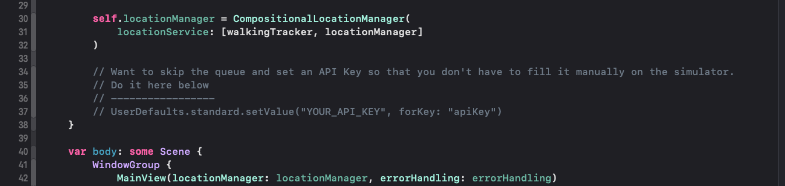
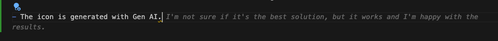

# GeoSnap - Location-Based Photo Fetching Service

| *GeoSnap is a demo Swift app that dynamically fetches photos from the Flickr API based on the user’s real-time location. Leveraging Core Location and ActivityKit, the app tracks the user’s movement and retrieves new photos when they travel more than 100 meters.* |  |
|:------------------------------------------------------------------------------------------------------------------------------------------------------------------------------------------------------------------------------------------------|:--------------------------------:|

## Features

- **Location-Based Photo Retrieval**: Fetches photos from Flickr by utilizing the user's geographic coordinates, updating the content as the user moves.

- **Dynamic Photo Updates**: Automatically refreshes and fetches new images each time the user moves 100 meters or more from their previous location.
  
## User Interaction

A simple toggle allows users to start or stop location tracking.
Once tracking is started, the app will fetch new photos when the user moves 100 meters or more from their previous location. A **Clear** button (**DESTRUCTIVE ACTION**) allows users to clear the photos from the app.

> The app will not fetch new photos if the user is not moving.

> Photos are directly downloaded from the internet.

> The app will continue to work even if the user has the phone locked and in his pocket.

> A live action is displayed when the app is fetching new photos.

- **Error Handling**: Provides real-time error alerts, such as for invalid API keys, and allows the user to seamlessly correct input without interrupting the user experience.
  

## Technologies Used

- **Swift**: The primary programming language for developing the app, incorporating modern SwiftUI features.
- **SwiftUI**: Used to create the dynamic user interface, leveraging state management and view composition.
- **Core Location**: To track the user's real-time location, triggering updates when a certain distance is covered.
- **ActivityKit**: Helps manage real-time activities and updates related to the user's location movements.
- **URLSession**: Used for making asynchronous network requests to the Flickr API to fetch images.
- **JSON Parsing**: Decodes the API responses into models that are used throughout the app.
- **UserDefaults**: To manage persistent storage of API keys, allowing users to update and reuse their credentials without re-entering them each time.
- **SwiftData**: Utilized for lightweight data persistence, making it easy to work with models and cache image data.
- **SOLID Principles**: The app’s architecture is built with an emphasis on SOLID principles for maintainability, testability, and scalability.
- **XCTest**: Used for unit testing.

## Demo

Here are some demonstrations of the app in action:

## Code Architecture

The app follows a well-structured and modular design based on the SOLID principles.
It's based on the principle of offline first. Currently it requires internet connection to fetch images from Flickr, once downloaded they will be available even if offline.

Each component, such as location tracking, API communication, and error handling, is separated into manageable, reusable units.

## Future Improvements

- **Caching Mechanism**: Implement local file caching to save images and reduce network requests while not compromising the app's size.
- **Enhanced UI/UX**: Continue refining animations and user feedback for a more polished experience.
- **Support for Multiple APIs**: Extend the app to allow fetching images from additional sources beyond Flickr.
- **Unit Testing**: Write more unit tests to ensure the app's functionality and stability.
- **Multiple Image Support**: Extend the app to allow fetching & presenting more than one image from Flickr per location update. This would also allow to download a different image for a location for which the first image is already downloaded.
- **Live Activity**: Display more valuable information about the user's location, such as the current speed, distance from starting point, images downloaded while the app was not in foreground, etc.
- **Verify Possible Bugs**: Write more tests to verify that the app is working as expected. There's a big chance of having a few memory leaks. Mainly cuz I haven't used weak/unowned not even once. Nevertheles, running instruments to find them is not the way to go.

- **Linters and Formatters**: Integrate linters and formatters to ensure code quality and consistency.
- **Static Analysis**: Use static analysis tools to identify potential issues and improve code quality.

## Summary of Decisions

So, here it was, a justification to land into CoreLocation and ActivityKit. I'm not sure if it's the best solution, but it works and I'm happy with the results.

Let's go a bit around the process of building this app:
- Started by creating the Github repository so that it would be easier to see the evolution of the project.

- Dedicated some time to understand the Flickr API and how to use it. My best friend during this process was [Flickr API Explorer](https://www.flickr.com/services/api/explore/flickr.photos.search), which is a wrapper for the Flickr API that allows for setting up some configurations and testing the API.
- Once I was satisfied with the API, I started to implement the app starting with a very simple UI.
- Flickr API integration was first, following a process of development guided by tests.
- Core Location was next, making sure that the app would work even if the phone was locked. For this made a heavy use of the simulator (As it allows to activate mock routes that work as if the user is moving, ex. *Features->Location->Freeway Drive*).
- Splitting the development and dogfooding the app made me realize that the API Key could (and would) expire, so even if it was not my intention to do a lot of error handling on the scope of the app, I decided to implement it.

  > Life hack 😄: In a real device, you can paste the API Key in the app and it will work. But in the simulator, you have to manually enter the API Key. To avoid this, please make use of a breadcrumb I left in the GeoSnapApp.swift file. It will override the API Key with the one you want to use.

  

- To reduce direct interaction between components and keep the information between runs, the API key is stored in the UserDefaults. This is a good practice, but it's not the best solution. Secrets should be stored in a secure place, like Keychain.

- I also decided to implement a caching mechanism to save the images and reduce network requests, but it's not the best solution. A better way is to do file caching, so that the system, or the user, can claim the space occupied by the images and that they can be downloaded later again. *Tbh, I did it because I wanted to learn a bit more about SwiftData.*
  
- Once everything is connected, it becomes difficult to know if the app is running in the background or not, of course, it becomes blue and shows the location icon. Of course, I created an image with an overlay of the date when it was created, But I don't know, did not seemed enough. Hence, I decided to implement a live action (*Also cuz I wanted to experiment with it a bit 😅*) that will be displayed when the app is in walking mode and fetching new photos. The implementation is very limited, the bare bones. And it could include more relevant data, now it only shows the time since the walk session started.

- I attempted to put some care into modules and making everything testable and extensible, but would put even more effort in a real app, there are some places where this was not followed or I just decided to do it at the end when a feature was needed to be added and the architecture was too rigid for it.

- The icon is generated with Gen AI.
  

> ... and it's not the best solution, but it works and I'm happy with the results. 🤣

- There's some extent of Generative AI included in the process of building this app. But definitely, it's not at the level yet of being able to generate quality code. There's a lot of babysitting. Hope will get better with the release of the new version of Xcode.

- By now you may be wondering why I included so many features in the app. My philosophy goes like this: *"If there's nothing entirely new to learn from a take home project, then it's not worth to do it."* In this case, those new things are:
  - Deeper understanding of the SwiftUI framework.
  - Basic usage of SwiftData
  - Basic usage of the new SwiftUI Previews
  - Basic understanding of the ActivityKit & the new Life Activity & Dinamic Island APIs
  - Deeper understanding of Core Location
  - Basic usage of the concurrency framework
