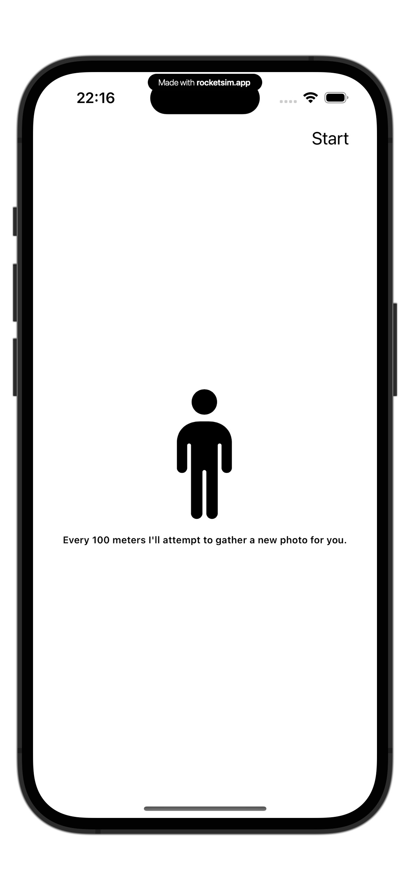
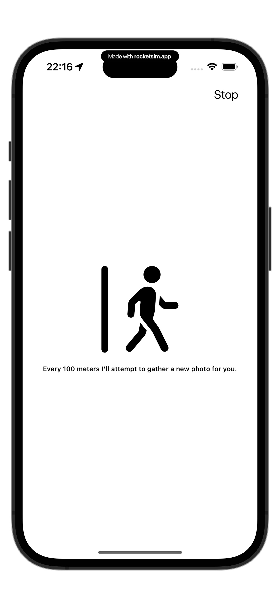
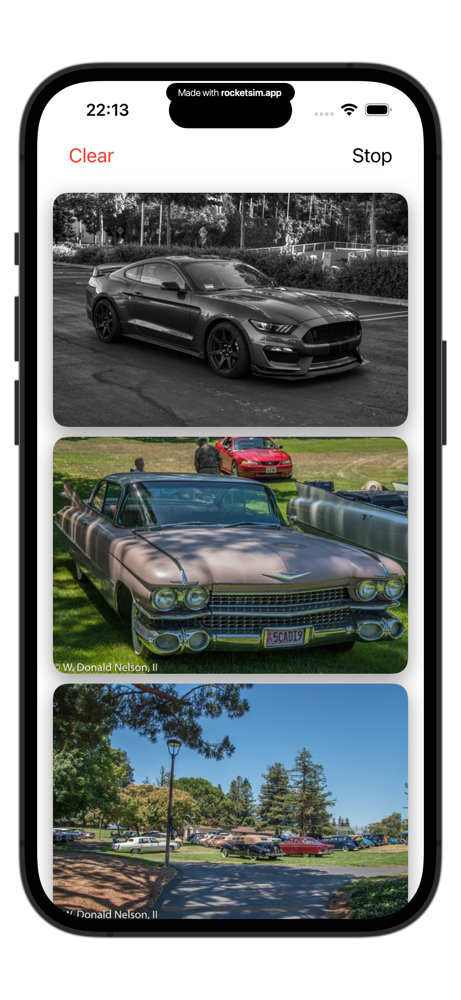
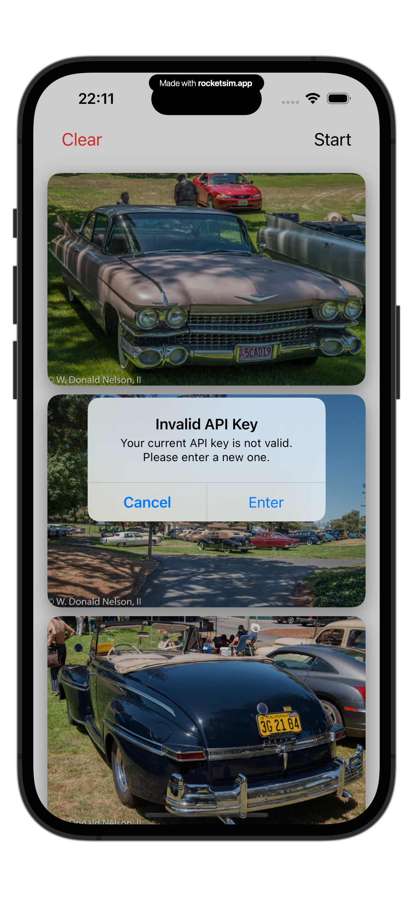
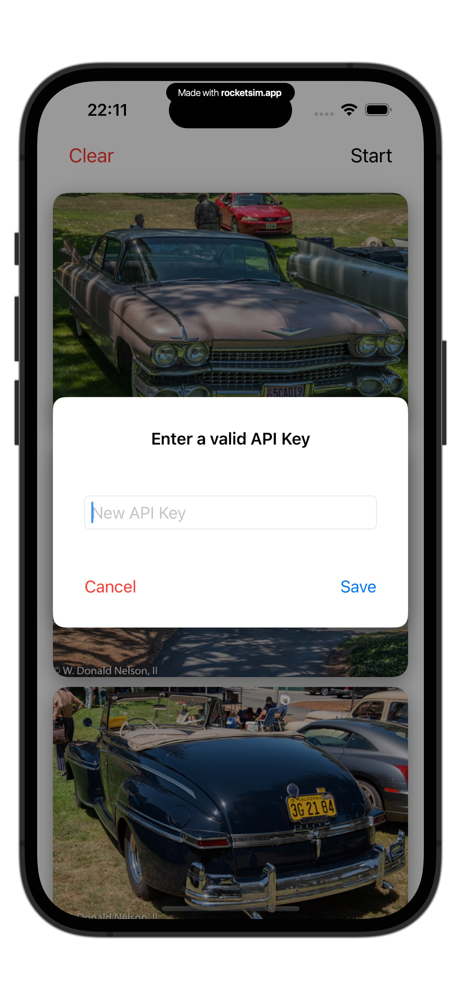
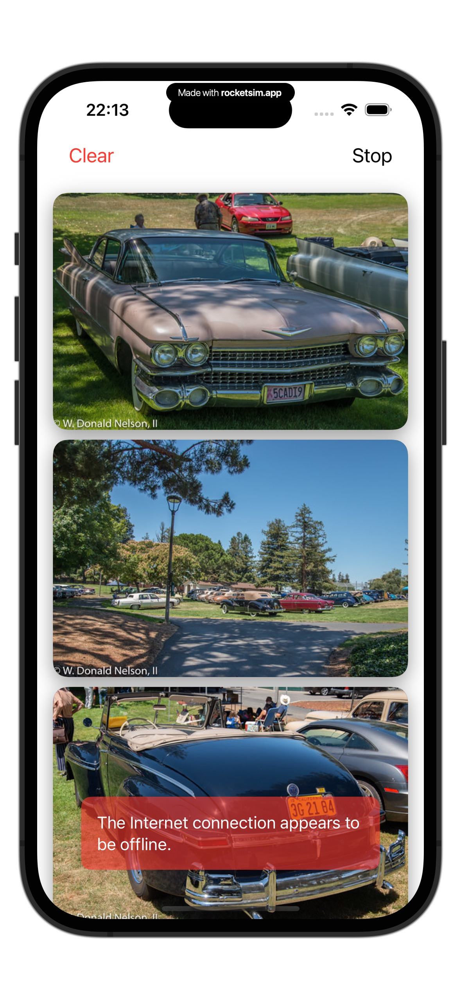

# GeoSnap - Location-Based Photo Fetching Service

  
  

    
GeoSnap is a demo Swift app that dynamically fetches photos from the Flickr API based on the user’s real-time location. Leveraging Core Location and ActivityKit, the app tracks the user’s movement and retrieves new photos when they travel more than 100 meters.

  

  

    
  

## Features

- **Location-Based Photo Retrieval**: Fetches photos from Flickr by utilizing the user's geographic coordinates, updating the content as the user moves.

- **Dynamic Photo Updates**: Automatically refreshes and fetches new images each time the user moves 100 meters or more from their previous location.
  
## User Interaction

A simple toggle allows users to start or stop location tracking.
Once tracking is started, the app will fetch new photos when the user moves 100 meters or more from their previous location. A **Clear** button (**DESTRUCTIVE ACTION**) allows users to clear the photos from the app.

> The app will not fetch new photos if the user is not moving.

> Photos are directly downloaded from the internet.

> The app will continue to work even if the user has the phone locked and in his pocket.

> A live action is displayed when the app is fetching new photos.

- .

- **Error Handling**: Provides real-time error alerts, such as for invalid API keys, and allows the user to seamlessly correct input without interrupting the user experience.
  

## Technologies Used

- **Swift**: The primary programming language for developing the app, incorporating modern SwiftUI features.
- **SwiftUI**: Used to create the dynamic user interface, leveraging state management and view composition.
- **Core Location**: To track the user's real-time location, triggering updates when a certain distance is covered.
- **ActivityKit**: Helps manage real-time activities and updates related to the user's location movements.
- **URLSession**: Used for making asynchronous network requests to the Flickr API to fetch images.
- **JSON Parsing**: Decodes the API responses into models that are used throughout the app.
- **UserDefaults**: To manage persistent storage of API keys, allowing users to update and reuse their credentials without re-entering them each time.
- **SwiftData**: Utilized for lightweight data persistence, making it easy to work with models and cache image data.
- **SOLID Principles**: The app’s architecture is built with an emphasis on SOLID principles for maintainability, testability, and scalability.
- **XCTest**: Used for unit testing.

## Demo

Here are some demonstrations of the app in action:

<video src="images/RecordingWithoutOverlay.mp4" width="44%"/>

## Code Architecture

The app follows a well-structured and modular design based on the SOLID principles.
It's based on the principle of offline first. Currently it requires internet connection to fetch images from Flickr, once downloaded they will be available even if offline.

Each component, such as location tracking, API communication, and error handling, is separated into manageable, reusable units.

## Future Improvements

- **Caching Mechanism**: Implement local file caching to save images and reduce network requests while not compromising the app's size.
- **Enhanced UI/UX**: Continue refining animations and user feedback for a more polished experience.
- **Support for Multiple APIs**: Extend the app to allow fetching images from additional sources beyond Flickr.
- **Unit Testing**: Write more unit tests to ensure the app's functionality and stability.
- **Multiple Image Support**: Extend the app to allow fetching & presenting more than one image from Flickr per location update. This would also allow to download a different image for a location for which the first image is already downloaded.
- **Live Activity**: Display more valuable information about the user's location, such as the current speed, distance from starting point, images downloaded while the app was not in foreground, etc.
